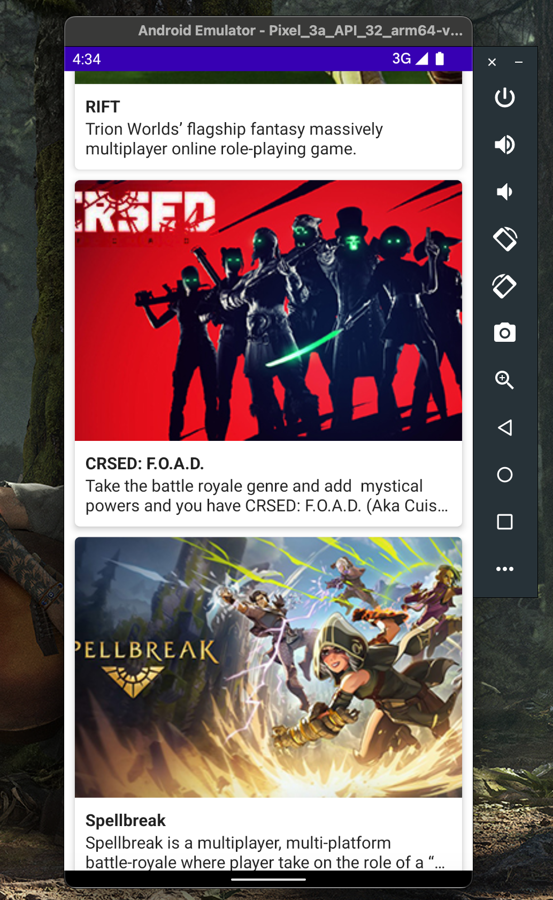

# Games App

Games App is a Jetpack Compose Android app that displays a scrolling list of free-to-play games from the FreeToGame API. The project demonstrates a small MVVM-style structure with separate data, repository, domain, ViewModel, and UI layers, plus Hilt dependency injection and Coil image loading.

## Preview



## Features

- Native Android app written in Kotlin
- Jetpack Compose UI
- MVVM-style screen state through `HomeViewModel`
- Hilt dependency injection
- Retrofit API client for FreeToGame
- Repository layer for fetching and mapping game data
- Domain use case for retrieving and shuffling games
- Coil image loading for remote thumbnails
- LazyColumn list of game cards
- Card UI with thumbnail, title, and short description
- Internet permission configured in the manifest
- Gradle wrapper included

## Project Structure

```text
.
+-- README.md
+-- images/
+|   +-- res.png
+-- build.gradle
+-- settings.gradle
+-- gradlew
+-- app/
+    +-- build.gradle
+    +-- src/main/
+        +-- AndroidManifest.xml
+        +-- java/com/example/mygameapp/
+            +-- app/
+            +-- data/
+            |   +-- model/
+            |   +-- network/
+            +-- domain/
+            |   +-- item/
+            +-- repository/
+            +-- ui/
+            |   +-- screens/
+            |   +-- theme/
+            +-- utils/
+            +-- viewmodel/
+```

## Architecture

The app follows this flow:

```text
HomeScreen
   -> HomeViewModel
      -> GetGamesUseCase
         -> GameRepository
            -> GameService
               -> GameApiInterface
                  -> FreeToGame API
```

Data returned by the API is mapped from `Game` to `GameItem` before it reaches the UI.

## Main Components

| File | Purpose |
| --- | --- |
| `ui/screens/MainActivity.kt` | App entry point. Applies theme and renders `HomeScreen()`. |
| `app/GamesApp.kt` | Application class annotated with `@HiltAndroidApp`. |
| `ui/screens/HomeScreen.kt` | Collects ViewModel state and renders a LazyColumn of game cards. |
| `viewmodel/HomeScreenViewModel.kt` | Hilt ViewModel that loads games and exposes `StateFlow<List<GameItem>>`. |
| `domain/GetGamesUseCase.kt` | Calls the repository and shuffles the game list. |
| `domain/item/GameItem.kt` | UI/domain model plus mapper from API model. |
| `repository/GameRepository.kt` | Fetches games from the service and maps them to domain items. |
| `data/network/GameService.kt` | Calls the API on `Dispatchers.IO` and returns a safe list. |
| `data/network/GameApiClient.kt` | Hilt module that provides Retrofit and `GameApiInterface`. |
| `data/network/GameApiInterface.kt` | Retrofit endpoint definition. |
| `data/model/Game.kt` | API response model. |
| `utils/Constants.kt` | API base URL and endpoint constants. |

## API

The app uses the FreeToGame API:

```text
https://www.freetogame.com/api/games
```

Configuration in `Constants.kt`:

| Constant | Value |
| --- | --- |
| `BASE_URL` | `https://www.freetogame.com/api/` |
| `All_GAMES_POINT` | `games` |

Retrofit endpoint:

```kotlin
@GET(All_GAMES_POINT)
suspend fun getAllGames(): Response<List<Game>>
```

## UI Behavior

`HomeScreen()` creates a `HomeViewModel`, collects `games` as Compose state, and renders each game with `GameCard()`.

Each card includes:

- remote thumbnail loaded by Coil
- game title
- two-line short description with ellipsis overflow
- rounded Material card styling
- fixed image height of `250.dp`

## Data Model

API model:

```kotlin
data class Game(
    val id: Int,
    val title: String,
    val thumbnail: String,
    val short_description: String
)
```

Domain/UI model:

```kotlin
data class GameItem(
    val id: Int,
    val title: String,
    val thumbnail: String,
    val short_description: String
)
```

`toGameItem()` maps API objects into UI-ready items.

## Tech Stack

- Kotlin
- Android
- Jetpack Compose
- Compose Material
- Lifecycle ViewModel
- StateFlow
- Coroutines
- Retrofit
- Gson converter
- Hilt
- Coil Compose
- Gradle wrapper
- Android Gradle Plugin `7.4.2`
- Kotlin Android plugin `1.7.0`
- Compose UI `1.3.1`
- Compose compiler extension `1.2.0`

## Android Configuration

| Setting | Value |
| --- | --- |
| Namespace | `com.example.mymovieapp` |
| Application ID | `com.example.mymovieapp` |
| Main Kotlin package | `com.example.mygameapp` |
| Min SDK | `24` |
| Target SDK | `33` |
| Compile SDK | `33` |
| Version | `1.0` |
| Application class | `com.example.mygameapp.app.GamesApp` |
| Main activity | `com.example.mygameapp.ui.screens.MainActivity` |
| Permission | `android.permission.INTERNET` |

## How to Run

Open the repository root in Android Studio, sync Gradle, and run the `app` configuration on an emulator or Android device.

From the command line, with Android SDK configured:

```bash
./gradlew :app:assembleDebug
```

## Notes

- This is a sample app for Compose, MVVM-style layering, API calls, and dependency injection.
- The app fetches live data from FreeToGame, so it needs internet access.
- `GetGamesUseCase` shuffles the returned games, so list order can change between app launches.
- Network errors are swallowed in `HomeViewModel`, so the current UI shows an empty list instead of an error state.
- The Gradle namespace/application id still use `mymovieapp`, while most Kotlin packages use `mygameapp`.
- `HomeScreenViewModel.kt` is stored under a `viewmodel` folder but declares the `com.example.mygameapp.ui.screens` package.
- The default Android starter tests are still present under a `mymovieapp` package.

## Possible Improvements

- Add loading and error states to the home screen
- Keep package, namespace, and test package names consistent with `mygameapp`
- Move `HomeViewModel` into a matching `viewmodel` package or move the file under `ui/screens`
- Add explicit Retrofit dependency alongside the Gson converter
- Add item click navigation to a game detail screen
- Add search, category, or platform filters
- Add previews for `GameCard`
- Add repository and ViewModel tests
- Add image placeholders and error images for Coil
